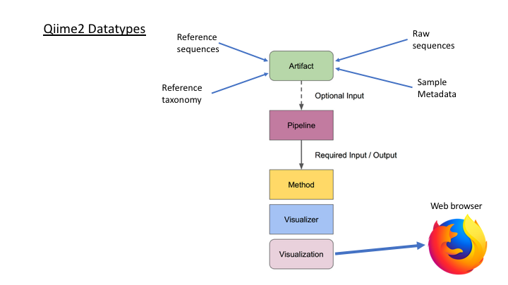
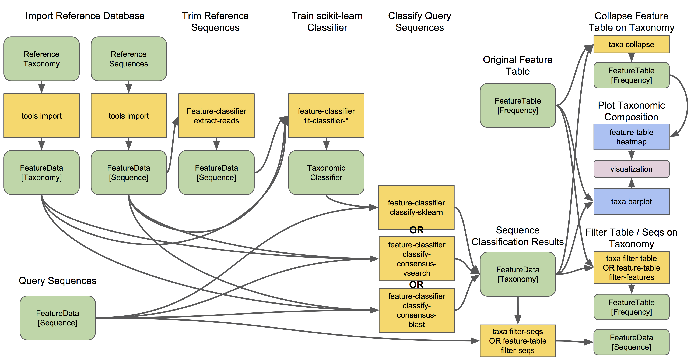

# Taxonomy Assignment: Getting Started

There are a number of methods available to assign taxonomy to your sequences, and even more software packages to run these. Today we will just provide an overview of the most common methods, using the Qiime2 package to run these. 

## Overview of Qiime2

The Qiime2 package is an open-source system that incorporates multiple, stand-alone programs, giving you many options to run your analysis. The different programs are provided as plug-ins to provide maximum flexibility. The [**Qiime2 docs webpage**](https://docs.qiime2.org/2020.8/) has all the information you need to get started on processing metabarcoding data. There are multiple tutorials available, including a [**detailed overview**](https://docs.qiime2.org/2020.8/tutorials/overview/) of the available plugins and links to the concepts involved. 

It is possible to run the entirety of your analysis within the Qiime2 system, but today we will just show how we incorporate one of its components, taxonomy assignment, into our workflow. Today, we will just give a quick guided tour of the system. This is only a starting point, and after this you should be able to go and try any of the other tutorials on the website with your own data.

<br>

## Tour of Qiime2 website

Now we will look over the resources on the [**Qiime2 website**](https://docs.qiime2.org/2020.8/)


<br><br><br>

### Qiime2 basics

Here is an overview of the Qiime2 workflow:


<br>

All files have to be imported into the Qiime2 format:




<br>

## Taxonomy Assignment in Qiime2





### Getting started: importing files into Qiime2 format

We first need to import the files produced in this morning's lesson into the Qiime2 format so they can be processed. In the command line, we will first load the Qiime2 module:

```
module load QIIME2/2020.8
```

To see the options for any Qiime2 command, you can use help:

```
qiime tools import --help
```

First, we will import the zOTU fasta file:

```
qiime tools import \
  --type 'FeatureData[Sequence]' \
  --input-path zotus.fasta  \
  --output-path zotu.qza
```

Next, we will import the frequency table. Two steps are needed for this. First we import the table into a biom format. The biom program is included with the Qiime2 module.

```
biom convert -i zotutab.txt -o fish_frequency.biom --to-hdf5
```

Next, import the biom file into Qiime:

```
qiime tools import \
  --input-path fish_frequency.biom \
  --type 'FeatureTable[Frequency]' \
  --input-format BIOMV210Format \
  --output-path fish_frequency_table.qza
```

### Visuals in Qiime2

Now that we have some files imported, we can create a visual. All visualisations in Qiime2 can be opened in a web browser, and are designed to be interactive in order to explore your data. We will start by creating a visual of the OTUs we just imported.

```
qiime feature-table tabulate-seqs \
  --i-data zotus.fasta \
  --o-visualization zotus_tabulation.qzv
```

All visualisations in Qiime2 should end with *.qzv*

There is a command to view a Qiime2 visual, however, since we are on a server, you would need to download the visual first to your own computer. For the workshop, I have provided links to these visuals that can be opened using the Qiime2View webpage. In order to open these, click on the link below (it should open in separate window)

[Qiime2View webpage](https://view.qiime2.org/)

To view our new visual, copy the link below (do not click on it).

https://otagoedna.github.io/2019_11_28_edna_course/example_viz/fish_OTUs_tabulation.qzv

Then go to the Qiime2View website, click on 'file from the web', and paste the link in the box that opens up.

This visual shows the sequence for each zOTU. You can run a BLAST search on each zOTU by clicking on the sequence. However, the search can take a while, depending on how busy the NCBI server is. To illustrate the kind of results you get, I have prepared a table that summarises the results for each zOTU

From the BLAST results, it is possible to make a determination of the nearest species for each OTU. However, for studies involving hundreds or even thousands of OTUs, this is impractical. Generally it is advised to follow one of the taxonomic classification methods available, as this is more reproducible and rigorous. As well, the BLAST algorithm is not necessarily the best way to search the database for the best match. 

<br>

## Reference Databases

The vast majority of metabarcoding literature focus on analysis of bacterial 16S data, and for these studies there are several existing databases, pre-formatted for Qiime and other software packages. For research utilising the ribosomal gene regions in fungi (ITS) and animals (18S), there are also good resources. There are details and links to these on the [**Qiime data resources page**](https://docs.qiime2.org/2020.8/data-resources/).

For studies of eukaryotes using mitochondrial genes, the [**Midori database**](http://www.reference-midori.info/) is available, and includes pre-formatted databases for Qiime and other popular software packages. This is the database we will use for our fish example dataset today. 

It is advised that researchers use only 'curated' databases for assigning taxonomy. By *curated*, it means that the taxonomic status of each sequence is confirmed, and issues like synonyms or 'environmental' taxa have been removed. Additionally, it is recommended to *dereplicate* your database by species, so that identical sequences from the same species are represented by only a single accession. 

For any other study (or to check for gaps in any of the above databases), the [**NCBI**](https://www.ncbi.nlm.nih.gov/) and [**EMBL**](https://www.embl.org/) sequence databases have the largest collection of sequences. However, both of these databases are subject to error and searches on them can be inexact and recover sequences that are not the correct gene, misidentified or unassigned taxa. Care must be taken when using either of these databases.

Even with the pre-formatted databases mentioned above, some additional steps are advised to prepare a database for taxonomy assignment. For most genes (though not all), it is recommended to extract each sequence around the primers used to amplify the target region in order to improve accuracy.  The process to prepare the lrRNA Midori database used today is [**described here**](preparing_database.md). The steps used can take a long time, depending on the size of the database, so we will not cover this today. However, in addition to the commands used, we are including links to example job scripts, and other resources online. Please contact us for advise on any gene region. 


<br>

We will now continue on to [**trialing the different methods**](tax_assignment_part2.md)