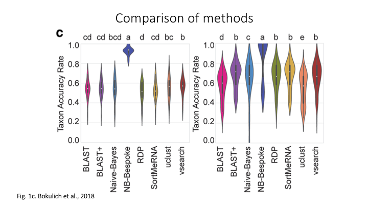
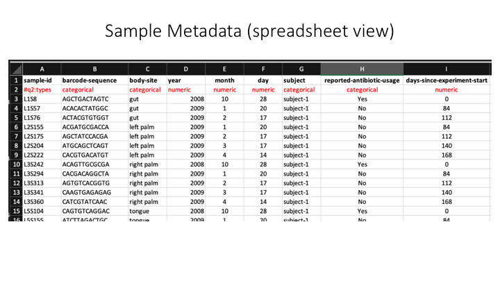
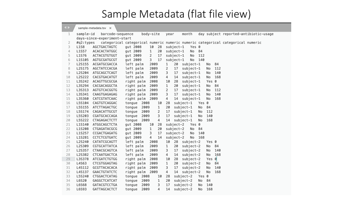

# Taxonomy Assignment: Different Approaches

There are three basic approaches to taxonomy classification (and endless variations of each of these): Global alignment, local alignment, and Naive Bayes, or machine learning approaches in general. 



for a discussion of them see the [**paper**](https://microbiomejournal.biomedcentral.com/articles/10.1186/s40168-018-0470-z). 


## Aligment-Based Methods

Earlier we saw results from a BLAST search of the sequences. This tool is one of the most common methods of searching DNA sequences. BLAST is an acronym for Basic Local Alignment Search Tool. It is called this because it looks for any short, matching sequence, or local alignments, with the reference. This is contrasted with a *global alignment*, which tries to find the best match across the entirety of the sequence.  


<br>

Though BLAST is widely used, it is not necessarily the best way to search for matching sequences in metabarcoding studies. 


<br><br>

## Using Machine Learning to Assign Taxonomy

Another way to assign taxonomy utilises machine learning algorithms. 


<br><br>


### Use Naive Bayes (machine learning) to classify in Qiime

In order to use the Naive Bayes (NB) method to assign taxonomy, it is necessary to train the sequence database first. Because this can take a great deal of time, a pre-trained classifier has been made available for you. The details of how this classifier was 'trained' appear on the **database preparation page**](preparing_database.md). The [Qiime2 Data Resources page](https://docs.qiime2.org/2020.8/data-resources/) provides some pre-trained classifiers for common primer combinations, as well as links to the Greengenes and Silva databases for 16S and 18S gene studies. For additional primer combinations, or other gene references, there is a [tutorial for training feature classifiers](https://docs.qiime2.org/2020.2/tutorials/feature-classifier/).

Use the command below, changing the name of the rep-seqs artifact that you have created:

```
qiime feature-classifier classify-sklearn \
  --i-classifier references/gg-13-8-99-515-806-nb-classifier.qza \
  --i-reads zotu.qza \
  --o-classification fish_zotu_NB_taxonomy.qza
```

You can then create a visualisation of the classification:

```
qiime metadata tabulate \
  --m-input-file fish_zotu_NB_taxonomy.qza \
  --o-visualization fish_zotu_NB_taxonomy_VIZ.qzv
```

As with the previous visualisation, open up the [Qiime2View webpage](https://view.qiime2.org/) and paste in the following link:

https://otagoedna.github.io/2019_11_28_edna_course/example_viz/fish_OTUs_NB_taxonomy_VIZ.qzv


A barplot graph is a good way to compare the taxonomic profile among samples. For this we also need a text file that has sample metadata. For this exercise, one is provided, but for your own projects, they can be as simple or complex as needed. They do not even need to have fields (but this will limit downstream analysis). You can prepare it in Microsoft Excel, but then you need to export it as a tab-delimited text file (e.g. .tsv)

Here is an example metadata file in Excel:



And here is the same example, but in a plain (tab-delimited) text file:



With the sample metadata, you can now create a bar plot of your taxonomy assignments. Qiime combines the information from all these sources in the visual:


Run the command:

```
qiime taxa barplot \
  --i-table fish_frequency_table.qza \
  --i-taxonomy fish_zotu_NB_taxonomy.qza \
  --m-metadata-file sample_metadata.tsv \
  --o-visualization fish_zotu_NB_taxonomy_barplot.qzv
```

To view, paste the following link into the [Qiime2View webpage](https://view.qiime2.org/):

https://otagoedna.github.io/2019_11_28_edna_course/example_viz/fish_OTUs_NB_taxonomy_bar_plots.qzv

<br><br>

### Exporting Qiime files

For some downstream analyses, it is necessary to convert our qiime-formatted files into flat (plain text) files so they can be used in other programs. Most Qiime files can be converted with the simple `qiime tools export` command. We will convert the taxonomy of classification that we just made:

The `export` command needs to be first exported to a folder, so we will make one:

```
mkdir exports
```

Now, use qiime to export

```
qiime tools export \
  --input-path fish_zotu_NB_taxonomy.qza \
  --output-path exports
```

This creates a file called *taxonomy.tsv*. We will rename that so there is no confusion:

```
mv exports/taxonomy.tsv fish_zotu_NB_taxonomy.tsv
```

<br><br>

## Try Taxonomy Assignment with VSEARCH (global alignment method)

..more to come

- try vsearch with basic parameters
- redo with more strigent parameters
- final script that runs twice


<br><br>

## Collapse frequency table by taxonomy assignment

When we made the barplots, Qiime2 combines the information from the frequency and taxonomy tables (and sample metadata). For some downstream applications, you might want to collapse the OTU frequencies around their taxonomy assignments. We have a handy script that will do that. All you need is the original frequency table and the flat file version of the taxonomy assignments (exported from Qiime above).

```
../scripts/collapse_by_taxonomy.py \
  -f zotutab.txt \
  -t fish_zotu_NB_taxonomy.tsv
```

The outputs from this script are taxonomy and frequency tables for which the OTUs have been collapsed around the taxon to which it was assigned.


 